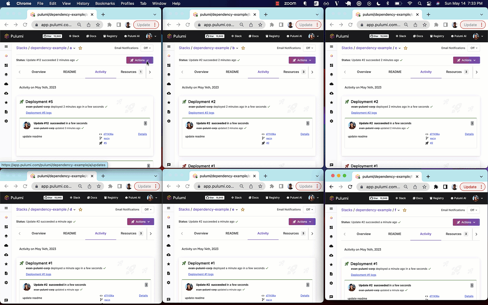

As infrastructure projects grow in size and complexity, you need to decompose infrastructure into smaller stacks to limit the blast radius of errors, extract and reference common layers like networking, and to limit access to sensitive components. This comes with a coordination cost as you now need to figure out how to detect and propagate changes to downstream stacks in your dependency graph. Today we’re announcing two features that can help you manage this complexity by automatically updating dependent stacks.

```
The following example shows automatic deployment of stacks with the following dependency graph

    a
    ├── b
    │   ├── d
    │   ├── e
    │   └── f
    └── c

Whenever a node in the graph is updated, all downstream nodes will be automatically updated via a webhook triggering Pulumi Deployments.
```



[Automatically updating dependent stacks](https://github.com/pulumi/pulumi/issues/2309) and providing a way to write Pulumi programs that can [express nested stack updates](https://github.com/pulumi/pulumi/issues/2209) are two of the most requested features across the Pulumi project, and we’re excited to enable both of these via Pulumi Cloud and Pulumi Deployments.

## Deployment Webhook Destinations

Pulumi Webhooks allow you to pick one or more event types on a stack (i.e. `update completed`, or `refresh failed`) and automatically deliver an event to a destination such a slack channel or a webserver you’ve deployed with custom code. Now you can choose Pulumi Deployments as a webhook destination. When an update completes on the parent stack, a deployment will automatically be triggered on the destination stack. This makes it easy to keep dependent stacks up to date. For instance, you can use Deployment Webhook Destinations to configure every successful update on your `networking` stack to trigger downstream updates on your `database` and `compute` stacks.

```ts
import * as service from "@pulumi/pulumiservice";

// when the `network/prod’ stack gets updated, trigger a deployment on `database/prod`
const databaseWebhook = new service.Webhook("databaseWebhook", {
    organizationName: "org",
    projectName: “network,
    stackName: “prod”,
    format: service.WebhookFormat.PulumiDeployments,
    payloadUrl: "database/prod",
    active: true,
    displayName: "deploy-database",
    filters: [service.WebhookFilters.UpdateSucceeded]
});

// when the `database/prod` stack gets updated, trigger a deployment on `compute/prod`
const computeWebhook = new service.Webhook("computeWebhook", {
    organizationName: "org",
    projectName: “database,
    stackName: “production”,
    format: service.WebhookFormat.PulumiDeployments,
    payloadUrl: "compute/prod",
    active: true,
    displayName: "deploy-compute",
    filters: [service.WebhookFilters.UpdateSucceeded]
});
```

## Expressing Stack Dependencies with `pulumi-auto-deploy`

We’ve also shipped a new Pulumi package called [`pulumi-auto-deploy`](github.com/pulumi/pulumi-auto-deploy). It let’s you simply express dependencies between stacks, and takes care of creating and updating the necessary Deployment Webhooks under the hood.

```ts
import * as autodeploy from "@pulumi/auto-deploy";

// declare my stacks in reverse dependency order, specifying downstream stacks as we go.
export const f = new autodeploy.AutoDeployer("auto-deployer-f", {
    org,
    project,
    stack: "f",
    downstream: [],
    pulumiAccessToken,
});

export const e = new autodeploy.AutoDeployer("auto-deployer-e", {
    org,
    project,
    stack: "e",
    downstream: [],
});

export const d = new autodeploy.AutoDeployer("auto-deployer-d", {
    org,
    project,
    stack: "d",
    downstream: [],
});

export const c = new autodeploy.AutoDeployer("auto-deployer-c", {
    org,
    project,
    stack: "c",
    downstream: [],
});

export const b = new autodeploy.AutoDeployer("auto-deployer-b", {
    org,
    project,
    stack: "b",
    downstream: [d, e, f],
});

export const a = new autodeploy.AutoDeployer("auto-deployer-a", {
    org,
    project,
    stack: "a",
    downstream: [b, c],
});
```

Just declare an `AutoDeployer` resource for each stack, and any `downstream` stacks will automatically be updated whenever a stack in it’s dependency chain is updated.

## Scale Infrastructure with Software

At Pulumi, we build tools to help you scale your infrastructure footprint with software instead of just humans. Deployment Webhook Destinations and `pulumi-auto-deploy` give you the tools to keep all of your dependent infrastructure up to date with automation instead of manual runbooks and human-driven operations. 

Check out these resources to get started today:

- TODO Webhook Deployment Destinations docs
- TODO Pulumi-auto-deploy
- TODO Pulumi Deployments Documentation

Happy building!
